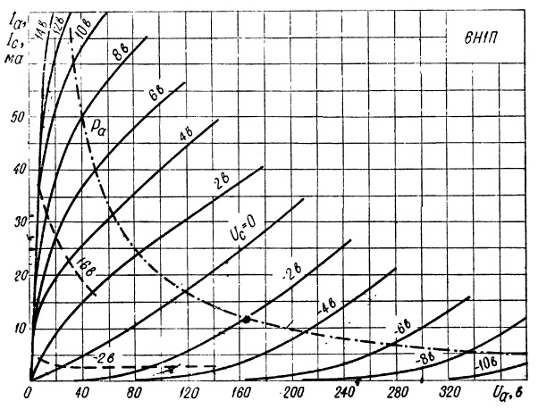
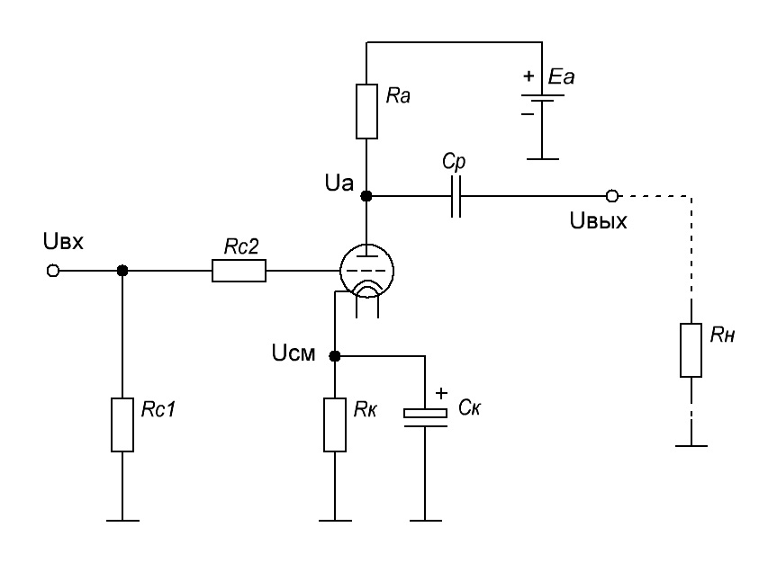

# tube-cascade
Библиотека для расчета элементной базы усилителя звука.

### Базовая функциональность
+ Определение номиналов для схемы усилителя на основе лампового триода с общим катодом.
+ Вычисление функции зависимости выходного сигнала от входного для рассчитанной элементной базы.
+ Приведение вычисленных значений сопротивления, емкости и напряжения к стандартным номинальным значениям (для резисторов и конденсаторов).
+ Расчет напряжения и мощности источника питания, необходимого для заданной элементной базы.

Библиотека содержит несколько базовых абстракций, позволяющих расширять и переопределять существующую логику

```c#
/// <summary>
/// Signal amplifying cascade calculator. 
/// </summary>
public interface ICascadeCalculator<in TInputData, TCascade>
	where TInputData : ICascadeInputData
{
	/// <summary>
	/// Calculate nominal values for elements of amplifying cascade
	/// based on <paramref name="inputData"/>.
	/// </summary>
	/// <param name="inputData">
	/// Input data for cascade calculation.
	/// </param>
	TCascade CalculateCascade(TInputData inputData);

	/// <summary>
	/// Define a dependency between input signal and output for <paramref name="cascade"/>.
	/// </summary>
	/// <param name="cascade">
	/// Signal amplifying cascade.
	/// </param>
	Func<Signal, Signal> GetAmplifyingFunction(TCascade cascade);

	/// <summary>
	/// Determine required power supply for <paramref name="cascade"/> with <paramref name="inputAcVoltage"/>.
	/// </summary>
	/// <param name="inputAcVoltage">
	/// Input AC voltage.
	/// </param>
	/// <param name="cascade">
	/// Amplifying cascade.
	/// </param>
	PowerSupply CalculateRequiredPowerSupply(Voltage inputAcVoltage, TCascade cascade);
}
```

```c#
/// <summary>
/// Input data for cascade calculation.
/// </summary>
public interface ICascadeInputData
{
	/// <summary>
	/// Supported input signal for cascade.
	/// </summary>
	public Signal InputSignal { get; }

	/// <summary>
	/// Input resistance of next cascade.
	/// </summary>
	public Resistance NextCascadeInputResistance { get; }
}
```

### Класс `TubeCascadeCalculator` - Расчет каскада на ламповом триоде
Расчет каскада выполняется на основе входных параметров, представленных типом `TubeCascadeInputData`:
```c#
/// <summary>
/// Input data for triode cascade calculation.
/// </summary>
/// <param name="InputSignal">
/// Supported input signal for cascade.
/// </param>
/// <param name="Tube">
/// Used vacuum triode.
/// </param>
/// <param name="NextCascadeInputResistance">
/// Input resistance of next cascade.
/// </param>
public readonly record struct TubeCascadeInputData(
	Signal  InputSignal, 
	VacuumTriode Tube, 
	Resistance   NextCascadeInputResistance) : ICascadeInputData;
```

Входной сигнал определяется амплитудой по напряжению и частотным диапазоном.
Модель лампового триода включает в себя следующие характеристики:
+ `NominalVoltage` - номинальное напряжение триода
+ `InternalResistance` - внутреннее сопротивление триода
+ `AnodeCharacteristics` - семейство анодных характеристик лампы *

Ниже приведено семейство анодных характеристик для двойного триода 6Н1П


Таким образом класс `TubeCascadeCalculator` поддерживает вычисления для различных триодов с косвенным накалом. Описанные выше характеристики для конкретного триода могут быть получены из [базы данных электронных компонентов](https://rudatasheet.ru/tubes/)

\* В описании технических характеристик триодов анодные характеристики представлены в виде кривых. В данной библиотеки с целью упрощения API характеристики представлены линейными функциями.

Результат вызова метода `TubeCascadeCalculator.CalculateCascade` - объект `TriodeAmpCascade`, содержащий номиналы элементов
(резисторов, конденсаторов, триода) со ссылками на схему каскада.

Ниже приведена схема каскада, для элементов которой выполняются вычисления


В процессе расчета элементной базы может возникнуть необходимость приведения полученных значений к стандартным номиналам по сопротивлению, емкости, напряжению (с округлением как в верхнюю, так и в нижнюю сторону).
Для этого необходимо реализовать интерфейсы `ICapacitors` и `IResistors` для конденсаторов и резисторов соответственно.

Для получения точных значений без округления необходимо инициализировать `TubeCascadeCalculator` следующим образом:

```c#
var calculator = new TubeCascadeCalculator(IResistors.Accurate, ICapacitors.Accurate);
```

### Пример использования
Ниже приведен пример расчета каскада для двойного триода 6Н1П при входном сигнале с амплитудой в 2В и частотным диапазоном 20Гц..20кГц.

```c#
var tubeAnodeCharacteristics = new AnodeCharacteristic[]
{
    new(GridAnodeVoltage: new(014), VoltageToCurrentRatio: 00.29),
    new(GridAnodeVoltage: new(012), VoltageToCurrentRatio: 00.53),
    new(GridAnodeVoltage: new(010), VoltageToCurrentRatio: 00.62),
    new(GridAnodeVoltage: new(008), VoltageToCurrentRatio: 00.80),
    new(GridAnodeVoltage: new(006), VoltageToCurrentRatio: 01.14),
    new(GridAnodeVoltage: new(004), VoltageToCurrentRatio: 02.67),
    new(GridAnodeVoltage: new(002), VoltageToCurrentRatio: 04.00),
    new(GridAnodeVoltage: new(000), VoltageToCurrentRatio: 06.40),
    new(GridAnodeVoltage: new(-02), VoltageToCurrentRatio: 12.00),
    new(GridAnodeVoltage: new(-04), VoltageToCurrentRatio: 22.00),
    new(GridAnodeVoltage: new(-06), VoltageToCurrentRatio: 52.00),
    new(GridAnodeVoltage: new(-08), VoltageToCurrentRatio: 68.00),
    new(GridAnodeVoltage: new(-10), VoltageToCurrentRatio: 72.00),
};

var tube = new VacuumTriode(
    NominalVoltage:       new Voltage(250),
    InternalResistance:   new Resistance(11 * Kilo),
    AnodeCharacteristics: tubeAnodeCharacteristics);

var inputSignal = new Signal(
    VoltageAmplitude: new Voltage(2),
    FrequencyRange:   (new Frequency(20), new Frequency(20 * Kilo)));

var inputData = new TubeCascadeInputData(
    InputSignal:                inputSignal,
    Tube:                       tube,
    NextCascadeInputResistance: new Resistance(50 * Kilo));

var calculator = new TubeCascadeCalculator(IResistors.Accurate, ICapacitors.Accurate);

var cascade = calculator.CalculateCascade(inputData);
```